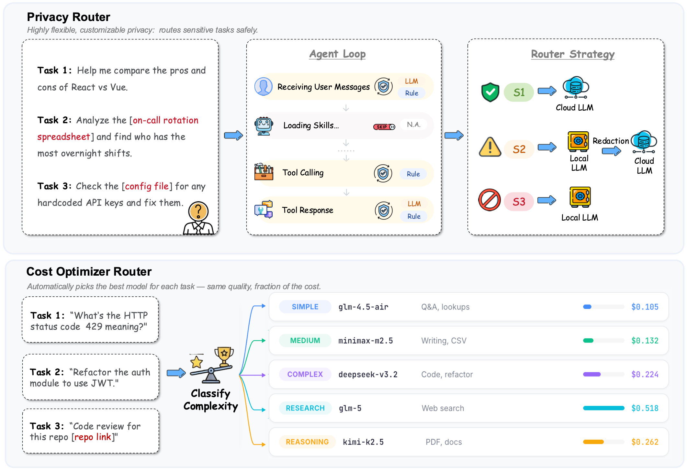

<div align="center">
  
</div>

<h3 align="center">
安全 · 高效 · 平衡
</h3>

<p align="center">
  端云协同的 AI 智能体路由插件<br>
  <b>ClawXRouter</b>：让每条请求自动走最合适的路
</p>

<p align="center">
  <a href="../LICENSE"></a>
  <a href="https://github.com/openbmb/clawxrouter"></a>
  <a href="https://github.com/openbmb/clawxrouter/issues"></a>
</p>

<p align="center">
    【中文 | <a href="./README.md"><b>English</b></a>】
</p>

---

**最新动态** 🔥

- **[2026.03.25]** 🎉 ClawXRouter 正式开源，端云协同 AI 智能体路由

---

## 📑 目录

- [💡 关于 ClawXRouter](#-关于-clawxrouter)
- [🎬 Demo](#-demo)
- [📦 快速开始](#-快速开始)
- [📈 性价比路由：4折价格超越Sonnet！](#-性价比路由4折价格超越sonnet)
- [🔧 自定义配置](#-自定义配置)
- [🔌 支持的端侧 Provider](#-支持的端侧-provider)
- [🔒 三级隐私路由](#-三级隐私路由)
- [💰 性价比感知路由](#-性价比感知路由)
- [🚀 可组合路由管线](#-可组合路由管线)
- [🏗️ 代码结构](#️-代码结构)
- [🤝 贡献指南](#-贡献指南)
- [📖 相关引用](#-相关引用)

---

## 💡 关于 ClawXRouter

ClawXRouter 是一个**端云协同的 AI 智能体路由插件**，由 [THUNLP（清华大学）](https://nlp.csai.tsinghua.edu.cn)、[中国人民大学](http://ai.ruc.edu.cn/)、[AI9Stars](https://github.com/AI9Stars)、[面壁智能（ModelBest）](https://modelbest.cn/en) 和 [OpenBMB](https://www.openbmb.cn/home) 联合开发，构建于 [OpenClaw](https://github.com/openclaw/openclaw) 之上，根植于[EdgeClaw](https://github.com/openbmb/Edgeclaw)。

AI Agent 正在深刻改变开发者的日常工作方式，然而在实际落地过程中，当前的 Agent 使用模式暴露出三大突出问题：**云侧不敢用**（隐私泄露）、**云侧用不起**（简单任务也烧贵 token）、**端侧用不好**（本地模型干不了硬活）。

针对上述三大痛点，ClawXRouter 给出对应的解法：

- **🔒 不敢用 → 三级隐私路由**：自动识别敏感数据，私密信息（S3）物理隔离在本地，由端侧模型离线处理，云侧完全不可见——从根本上消除泄露风险，让用户**放心用**；code review 遇到 API Key，请求不出本机
- **💰 用不起 → 性价比感知路由**：端侧小模型做 LLM-as-Judge，按任务复杂度分为五级，路由到不同价位的云侧模型——省 58% 的钱，PinchBench 跑分还高 6.3%，让用户**用得起**；grep 函数名走便宜模型，不必全用昂贵的顶流模型
- **🔗 用不好 → 智能脱敏转发**：对于涉及敏感信息的复杂任务，端侧模型能力不足时不必硬扛——多文件复杂数据分析等场景，自动脱敏后转发云侧（S2），既保护隐私又借助云端专业能力，让用户**用得好**
- **🎛️ 个性化 → 可组合管线与 Dashboard**：隐私路由与性价比路由在同一管线中通过权重与短路策略协同工作，配合可视化 Dashboard 支持规则自定义、配置即时生效与实时测试，让每位用户按自身需求灵活调整

两套路由运行在同一可组合管线中：端侧双引擎（规则检测 ~0ms + 本地 LLM 语义检测 ~1-2s）实时判别每条请求的敏感度与复杂度，安全优先短路、性价比按需生效。开发者无需修改业务逻辑，即可实现**"公开数据上云、敏感数据脱敏、私密数据落地"**的无感端云协同。


<div align="center">
  
</div>

---

## 🎬 Demo

<div align="center">
  <video src="https://github.com/user-attachments/assets/f545a793-1c40-4d42-af38-316343b23c5c" width="70%" controls></video>
</div>

---

## 📦 快速开始

### 安装

```bash
# 前置条件：已安装 OpenClaw

# 通过 npm 安装（推荐）
npm install -g @openbmb/clawxrouter

# 或从 ClawHub 安装
openclaw plugins install clawhub:clawxrouter

# （可选）安装本地推理后端
ollama pull openbmb/minicpm4.1
ollama serve
```

### 启动

```bash
openclaw gateway
# ClawXRouter Ready! Dashboard → http://127.0.0.1:18789/plugins/clawxrouter/stats
```

完成。每条请求现在会自动走最优路径。

---

## 📈 性价比路由：4折价格超越Sonnet！

使用 [PinchBench](https://pinchbench.com)（23 项 OpenClaw Agent 基准测试）验证路由效果。

### 五层分级 & 模型配置

| 级别 | 描述 | 默认模型 |
|------|------|------|
| SIMPLE | 摘要、改写、简单问答、打招呼 | `glm-4.5-air` |
| MEDIUM | 写邮件、写脚本、数据分析、项目脚手架 | `minimax-m2.5` |
| COMPLEX | 批量邮件分拣、多文件创建、结构化数据提取 | `deepseek-v3.2` |
| RESEARCH | 长文写作、多源整合工作流 | `glm-5` |
| REASONING | 深度 PDF 分析、数学证明、实验设计 | `kimi-k2.5` |

### 结果

| 方案 | PinchBench 跑分（Best / Avg） | 成本 |
|------|-------------------------------|------|
| **ClawX 路由（5 模型混合）** | **93.2% / 89.6%** | **$2.36** |
| 全部用 Sonnet 4.6 | 86.9% / 79.2% | $5.63 |

> **省 58% 的钱，分数还高 6.3%。**

---

## 🔧 自定义配置

所有配置均支持两种修改方式：**Dashboard 实时编辑**（推荐）或 **JSON 文件**（适合脚本化部署）。

### Dashboard 配置（推荐）

打开 `http://127.0.0.1:18789/plugins/clawxrouter/stats`，所有改动即时生效、无需重启。

#### 检测规则

**Router Rules** Tab → 展开 **Privacy Router** 卡片：

1. **Keywords** — 直接添加 / 删除 S2、S3 关键词标签
   - 左列 **S2 — Sensitive (Redact → Cloud)**：输入后点 `Add`，如 `password`、`api_key`
   - 右列 **S3 — Confidential (Local Model Only)**：如 `ssh`、`private_key`、`.pem`
2. 展开 **Advanced Configuration** → **Detection Rules (Regex & Tool Filters)**：
   - **Regex Patterns**：添加正则，如 `(?:mysql|postgres|mongodb)://[^\s]+`
   - **Sensitive Tool Names**：如 `execute_sql`、`sudo`
   - **Sensitive File Paths**：如 `~/secrets`、`~/private`、`~/.ssh`、`~/.aws`、`~/.config/credentials`
3. 点击 **Save Privacy Router**

#### 检测器组合

**Privacy Router** → **Advanced Configuration** → **When to Run**：

每阶段有两个 Chip 按钮（点击切换激活 / 取消）：

| 阶段 | Keyword & Regex | LLM Classifier |
|------|:-:|:-:|
| User Message | ✅ | ✅ |
| Before Tool Runs | ✅ | — |
| After Tool Runs | ✅ | ✅ |

点击 **Save Privacy Router** 保存。

#### 管线执行顺序

**Router Rules** Tab → 点击 **Router Execution Order (Advanced)** 展开：

- 三个阶段各有标签列表；从下方 Picker 点击路由器添加，拖拽排序，✕ 移除
- 点击 **Save Execution Order**

#### 自定义路由器

**Router Rules** Tab → 底部 **Add Custom Router**：

1. 输入路由器 ID（如 `content-filter`），点击 **Add Router**
2. 卡片展开后可配置：Enabled 开关、S2/S3 关键词与正则、自定义 Prompt
3. 保存后自动注册到管线

#### Prompt 编辑

各路由器卡片内嵌 Prompt 编辑区：

| 路由器 | 可编辑 Prompt | 位置 |
|--------|-------------|------|
| Privacy Router | `detection-system` | 卡片内直接展示 |
| Cost-Optimizer | `token-saver-judge` | Cost-Optimizer 卡片内 |

直接编辑文本框，**Save** 即时生效，**Reset** 恢复默认。

#### 实时测试

修改配置后可即时验证效果：

- **全管线测试**：Router Rules 顶部 **Test Classification** 面板 — 输入消息、选择阶段，查看合并结果及各路由器独立判定
- **单路由器测试**：各路由器卡片底部 **Test** 区域 — 仅测试该路由器

### JSON 配置

配置文件路径：`~/.openclaw/clawxrouter.json`，Dashboard 保存的内容也会写入此文件。

#### 检测规则

```json
{
  "privacy": {
    "rules": {
      "keywords": {
        "S2": [
          "password", "api_key", "secret", "token", "credential", "auth_token",
          "salary", "地址", "电话", "手机号", "合同", "客户", "甲方", "乙方",
          "交易", "金额", "intranet", "域控"
        ],
        "S3": [
          "ssh", "id_rsa", "private_key", ".pem", ".key", ".env", "master_password",
          "身份证", "银行卡", "社保", "病历", "诊断", "处方", "密码", "密钥",
          "简历", "resume"
        ]
      },
      "patterns": {
        "S2": [
          "\\b(?:10|172\\.(?:1[6-9]|2\\d|3[01])|192\\.168)\\.\\d{1,3}\\.\\d{1,3}\\b",
          "(?:mysql|postgres|mongodb|redis)://[^\\s]+",
          "\\b(?:sk|key|token)-[A-Za-z0-9]{16,}\\b",
          "1[3-9]\\d{9}",
          "(?i)ghp_[a-zA-Z0-9]{36}",
          "(?i)xox[bsrap]-[a-zA-Z0-9-]+",
          "(?i)(?:contract|agreement)[-_]?\\w{6,}",
          "(?i)¥[\\d,]+\\.?\\d*|\\$[\\d,]+\\.?\\d*",
          "(?i)[a-z]+-(?:srv|dc|db|web|app)-\\d+",
          "(?i)[a-z]+\\\\[a-z0-9._-]+"
        ],
        "S3": [
          "-----BEGIN (?:RSA |EC |DSA |OPENSSH )?PRIVATE KEY-----",
          "AKIA[0-9A-Z]{16}",
          "\\d{17}[0-9Xx]",
          "\\d{4}[\\s-]?\\d{4}[\\s-]?\\d{4}[\\s-]?\\d{4}",
          "(?i)(password|passwd|pwd)\\s*[=:]\\s*['\"][^'\"]{8,}"
        ]
      },
      "tools": {
        "S2": { "tools": ["execute_sql"], "paths": ["~/secrets", "~/private"] },
        "S3": { "tools": ["sudo"], "paths": ["~/.ssh", "~/.aws", "~/.config/credentials", "/root", "/credentials/"] }
      }
    }
  }
}
```

#### 检测器组合

```json
{
  "privacy": {
    "checkpoints": {
      "onUserMessage": ["ruleDetector", "localModelDetector"],
      "onToolCallProposed": ["ruleDetector"],
      "onToolCallExecuted": ["ruleDetector", "localModelDetector"]
    }
  }
}
```

#### 管线执行顺序

```json
{
  "privacy": {
    "pipeline": {
      "onUserMessage": ["privacy", "token-saver", "content-filter"],
      "onToolCallProposed": ["privacy"],
      "onToolCallExecuted": ["privacy"]
    }
  }
}
```

> 启用隐私路由后，可将 `"privacy"` 加入各阶段，如 `"onUserMessage": ["privacy", "token-saver"]`。

#### 自定义路由器

实现 `ClawXrouterRouter` 接口可注入代码级路由逻辑：

```typescript
const myRouter: ClawXrouterRouter = {
  id: "content-filter",
  async detect(context, config) {
    if (context.message && context.message.length > 10000) {
      return {
        level: "S1",
        action: "redirect",
        target: { provider: "anthropic", model: "claude-sonnet-4.6" },
        reason: "Message too long, using larger context model",
      };
    }
    return { level: "S1", action: "passthrough" };
  },
};
```

```json
{
  "privacy": {
    "routers": {
      "content-filter": {
        "enabled": true,
        "type": "custom",
        "module": "./my-router.js",
        "weight": 60
      }
    }
  }
}
```

#### Prompt 自定义

修改 `clawxrouter/prompts/` 下的 Markdown 文件：

| 文件                    | 用途              |
| ----------------------- | ----------------- |
| `detection-system.md`   | S1/S2/S3 分类规则 |
| `token-saver-judge.md`  | 任务复杂度分类    |

### 🔌 支持的端侧 Provider

| Provider | API 类型 | 配置 `type` |
|----------|---------|-------------|
| [Ollama](https://ollama.com/) | OpenAI 兼容或原生 | `openai-compatible` / `ollama-native` |
| [vLLM](https://github.com/vllm-project/vllm) | OpenAI 兼容 | `openai-compatible` |
| [LM Studio](https://lmstudio.ai/) | OpenAI 兼容 | `openai-compatible` |
| [SGLang](https://github.com/sgl-project/sglang) | OpenAI 兼容 | `openai-compatible` |
| [LocalAI](https://localai.io/) | OpenAI 兼容 | `openai-compatible` |
| 任何 OpenAI 兼容服务 | `/v1/chat/completions` | `openai-compatible` |
| 自定义实现 | 用户模块 | `custom` |

---

## 🏛️ 工作原理

### 🔒 三级隐私路由

#### 三级灵敏度分类

"不敢用"的核心顾虑是即使在 code review 这种通用场景中，也可能不小心造成隐私数据上云。ClawXRouter 通过在 OpenClaw 执行流程中植入 Hook，自动将每一条用户消息、工具调用参数和 Agent 输出按敏感程度分为三级：

| 等级   | 含义 | 转发策略       | 示例                   |
| ------ | ---- | -------------- | ---------------------- |
| **S1** | 安全 | 直接发云侧模型 | "HTTP 403 和 401 有什么区别？" |
| **S2** | 敏感 | 脱敏后转发云侧 | 含内网 IP 的告警、含手机号的联系人 |
| **S3** | 私密 | 仅本地模型处理 | SSH 私钥、硬编码密码、工资单 |

#### 双检测引擎

| 引擎                | 机制                       | 延迟  | 覆盖场景                                    |
| ------------------- | -------------------------- | ----- | ------------------------------------------- |
| **规则检测器**      | 关键词 + 正则匹配          | ~0ms  | 已知模式：API Key、数据库连接串、PEM 密钥头 |
| **本地 LLM 检测器** | 语义理解（跑在本地小模型） | ~1-2s | 上下文推理："帮我分析这张工资单"、中文地址  |

两个引擎通过 `checkpoints` 配置按场景灵活组合，且内置短路优化——规则已判定 S3 时跳过 LLM（结果不可能更高），取最严格的结果。

#### S2 数据流：脱敏转发——用得好

```
用户消息（含 PII）
    → 本地 LLM 检测 S2，提取 PII → JSON 数组
    → 编程替换 → [REDACTED:PHONE], [REDACTED:ADDRESS]
    → Privacy Proxy (localhost:8403) → 剥离标记 → 转发云端
```

#### S3 数据流：完全本地处理——敢用

```
用户消息（含私密数据）
    → 检测为 S3
    → 转发本地 Guard Agent（Ollama / vLLM）
    → 云侧历史只写入 🔒 占位符
```

#### 双轨记忆 & 双轨会话

```
~/.openclaw/workspace/
├── MEMORY.md           ← 云侧模型看到的（自动脱敏）
├── MEMORY-FULL.md      ← 本地模型看到的（完整数据）
│
agents/{id}/sessions/
├── full/               ← 完整历史（含 Guard Agent 交互）
└── clean/              ← 清洁历史（供云侧模型使用）
```

云侧模型**永远看不到** `MEMORY-FULL.md` 和 `sessions/full/`，由 Hook 系统在文件访问层拦截。

#### 安全保证

**定理 1（云侧不可见性）**：对任意 S3 级数据 _x_，其原始内容在云侧完全不可见：

<p align="center">∀ <i>x</i>, &nbsp; Detect(<i>x</i>) = S₃ &nbsp;⟹&nbsp; <i>x</i> ∉ Cloud(<i>x</i>)</p>

**定理 2（脱敏完整性）**：对任意 S2 级数据 _x_，其云侧可见形式不包含原始隐私实体值：

<p align="center">∀ <i>x</i>, &nbsp; Detect(<i>x</i>) = S₂ &nbsp;⟹&nbsp; ∀ (<i>t<sub>i</sub></i>, <i>v<sub>i</sub></i>) ∈ Extract(<i>x</i>), &nbsp; <i>v<sub>i</sub></i> ∉ Cloud(<i>x</i>)</p>

---

### 💰 性价比感知路由

#### 为什么需要性价比感知路由？

"用不起"的根源在于，典型工作流中大部分请求只是查文件、看代码、简单问答，却统一交给最贵的模型处理。grep 一个函数调用也用 Claude，钱包受不了。ClawXRouter 的性价比感知路由用端侧小模型做 LLM-as-Judge，把请求按复杂度分为五级，路由到不同价位的云侧模型：

| 复杂度        | 任务示例                                           | 默认目标模型        |
| ------------- | -------------------------------------------------- | ------------------- |
| **SIMPLE**    | 摘要、改写、简单问答、打招呼                         | `glm-4.5-air`       |
| **MEDIUM**    | 写邮件、写脚本、数据分析、项目脚手架                 | `minimax-m2.5`      |
| **COMPLEX**   | 批量邮件分拣、多文件创建、结构化数据提取             | `deepseek-v3.2`     |
| **RESEARCH**  | 长文写作、多源整合工作流                             | `glm-5`             |
| **REASONING** | 深度 PDF 分析、数学证明、实验设计                    | `kimi-k2.5`         |


#### 智能缓存

Prompt 哈希缓存（SHA-256，TTL 5 分钟），相同请求不重复 Judge，进一步降低延迟开销。


---

### 🚀 可组合路由管线

隐私路由和性价比感知路由运行在**同一管线**中，遵循安全优先原则：隐私路由器高权重先跑，发现敏感数据直接短路处理；安全通过后才启动性价比感知路由优化成本。整个管线通过 10 个 Hook 覆盖从模型选择到会话结束的完整生命周期，无侵入式接管 OpenClaw 原有流程：

```
用户消息
     │
     ▼
┌──────────────────────────────────────────────┐
│           路由管线 (Router Pipeline)            │
│                                               │
│  Phase 1: 快速路由器 (weight >= 50) 并行执行    │
│  ┌─────────────┐                              │
│  │   隐私路由    │                              │
│  │  (权重:90)   │                              │
│  │  规则引擎     │                              │
│  │  + LLM 检测   │                              │
│  │  → S1/S2/S3  │                              │
│  └──────┬───────┘                              │
│         │                                     │
│  短路判断: 若 Phase 1 发现敏感数据 → 跳过 Phase 2  │
│         │                                     │
│  Phase 2: 慢速路由器 (weight < 50) 按需执行      │
│  ┌──────────────────┐                         │
│  │   性价比感知路由    │                         │
│  │  (权重:40)        │                         │
│  │  LLM-as-Judge     │                         │
│  │  → SIMPLE/MEDIUM/ │                         │
│  │    COMPLEX/REASON │                         │
│  └────────┬─────────┘                         │
│           │                                   │
│           ▼                                   │
│      合并决策 (Merge)                           │
└─────────────────────┬────────────────────────┘
                      │
          ┌───────────┼───────────┐
          ▼           ▼           ▼
     ┌─────────┐ ┌─────────┐ ┌─────────┐
     │   S3    │ │   S2    │ │   S1    │
     │  Guard  │ │  隐私    │ │  云端    │
     │  Agent  │ │  代理    │ │  模型    │
     │ (本地)   │ │ (脱敏   │ │ (分级   │
     │         │ │  转发)   │ │  路由)   │
     └─────────┘ └─────────┘ └─────────┘
```

#### 决策合并规则

管线按以下规则合并多个路由器的决策：

1. **安全级别最高的胜出**：S3 > S2 > S1
2. **同级别下，权重高的胜出**：privacy(90) > token-saver(40)
3. **`passthrough`（无意见）让位于 `redirect`（有意见）**：当隐私路由说"无敏感数据"，性价比路由说"转发到便宜模型"，后者生效
4. **多个 redirect 之间，行为严格的优先**：block > redirect > transform > passthrough

#### 端到端管线形式化

```
                                                    ⎧ θ_cloud(m)        if a = passthrough
m ─[c_msg]→ Detect(m) → l ─[c_route]→ R(l) → a → ⎨ θ_cloud(De(m))    if a = desensitize
                                                    ⎩ θ_local(m)        if a = redirect

  ─[c_persist]→ W(m, l) ─[c_end]→ Sync
```

#### 10 个 Hook 覆盖完整生命周期

| Hook                   | 触发时机      | 核心职责                    |
| ---------------------- | ------------- | --------------------------- |
| `before_model_resolve` | 模型选择前    | 运行管线 → 路由决策         |
| `before_prompt_build`  | Prompt 构建前 | 注入 Guard Prompt / S2 标记 |
| `before_tool_call`     | 工具调用前    | 文件访问守卫 + 子代理守卫   |
| `after_tool_call`      | 工具调用后    | 工具结果检测                |
| `tool_result_persist`  | 结果持久化    | 双轨会话写入                |
| `before_message_write` | 消息写入前    | S3→占位符, S2→脱敏版        |
| `session_end`          | 会话结束      | 记忆同步                    |
| `message_sending`      | 出站消息      | 检测并脱敏/取消             |
| `before_agent_start`   | 子代理启动前  | 任务内容守卫                |
| `message_received`     | 收到消息      | 观察性日志                  |

---

### 🏗️ 代码结构

```
clawxrouter/
├── index.ts                        # 插件入口（注册生命周期）
├── openclaw.plugin.json            # 插件清单
├── config.example.json             # 配置示例
│
├── src/
│   ├── router-pipeline.ts          # 可组合路由管线（两阶段 + 加权合并）
│   ├── detector.ts                 # 双引擎检测（规则 + LLM）
│   ├── rules.ts                    # 规则检测器（关键词 + 正则）
│   ├── local-model.ts              # 本地 LLM 检测器 + 脱敏引擎
│   ├── config-schema.ts            # TypeBox 配置模式 + 默认值
│   ├── routers/
│   │   ├── privacy.ts              # 隐私路由器（三级隐私路由）
│   │   ├── token-saver.ts          # 性价比感知路由器（省钱）
│   │   └── configurable.ts         # Dashboard 创建的自定义路由
│   ├── privacy-proxy.ts            # S2 PII 脱敏的本地 HTTP 代理
│   ├── provider.ts                 # Provider 注册 + 模型镜像
│   ├── guard-agent.ts              # S3 任务的专用本地 Guard Agent
│   ├── hooks.ts                    # OpenClaw Hook 集成
│   ├── session-manager.ts          # 双轨会话历史
│   ├── session-state.ts            # 每会话检测状态追踪
│   ├── memory-isolation.ts         # 双轨记忆（MEMORY-FULL.md vs MEMORY.md）
│   ├── live-config.ts              # 配置文件热重载监听
│   ├── prompt-loader.ts            # Prompt 文件加载器（从 prompts/）
│   ├── stats-dashboard.ts          # /plugins/clawxrouter/stats Web UI
│   ├── token-stats.ts              # 各级别 Token 用量追踪
│   ├── sync-detect.ts              # 同步 LLM 检测（Worker）
│   ├── sync-desensitize.ts         # 同步脱敏（Worker）
│   ├── llm-detect-worker.ts        # LLM 检测 Worker 线程
│   ├── llm-desensitize-worker.ts   # 脱敏 Worker 线程
│   ├── types.ts                    # 核心类型定义
│   ├── utils.ts                    # 路径规范化 + 辅助工具
│   └── worker-loader.mjs           # Worker 线程模块钩子
│
└── prompts/
    ├── detection-system.md         # 隐私检测 Prompt
    ├── guard-agent-system.md       # Guard Agent 系统 Prompt
    └── token-saver-judge.md        # 任务复杂度判断 Prompt
```

---

## 🤝 贡献指南

云侧不敢用、用不起，端侧用不好——ClawXRouter 的答案是：不必二选一，让端侧和云侧各尽其能。隐私路由让用户敢用，性价比路由让用户用得起，智能脱敏让用户用得好。项目将持续开源迭代，欢迎开发者与行业伙伴参与贡献，共同构建安全高效的端云协同 Agent 生态！

贡献流程：**Fork 本仓库 → 提交 Issues → 创建 Pull Requests（PRs）**

---

## ⭐ 支持我们

如果这个项目对你的研究或工作有帮助，请给一个 ⭐ 支持我们！

---

## 💬 联系我们

- 技术问题和功能请求请使用 [GitHub Issues](https://github.com/openbmb/clawxrouter/issues)

---

## 📖 相关引用

### 依赖项目

- [EdgeClaw](https://github.com/openbmb/Edgeclaw) — 端云协同AI智能体框架
- [OpenClaw](https://github.com/openclaw/openclaw) — 基础 AI 助手框架
- [MiniCPM](https://github.com/OpenBMB/MiniCPM) — 推荐的本地检测模型
- [Ollama](https://ollama.ai) — 推荐的本地推理后端

### License

MIT
